

 

| **System Fetch, Pacman Colorscript, App Launcher and Notif. Center** |
| -------------------------------------------------------------------- |
| 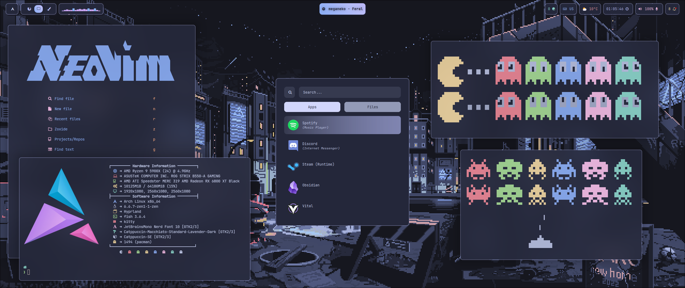               |

| **Text Editor**                                        |
| ------------------------------------------------------ |
| 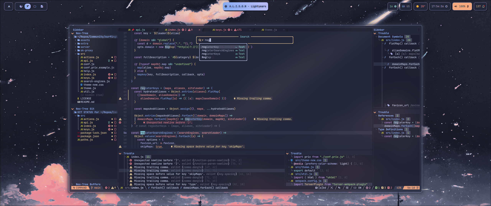 |

| **TUI File Manager, ls replacement and System Fetch**  |
| ------------------------------------------------------ |
| 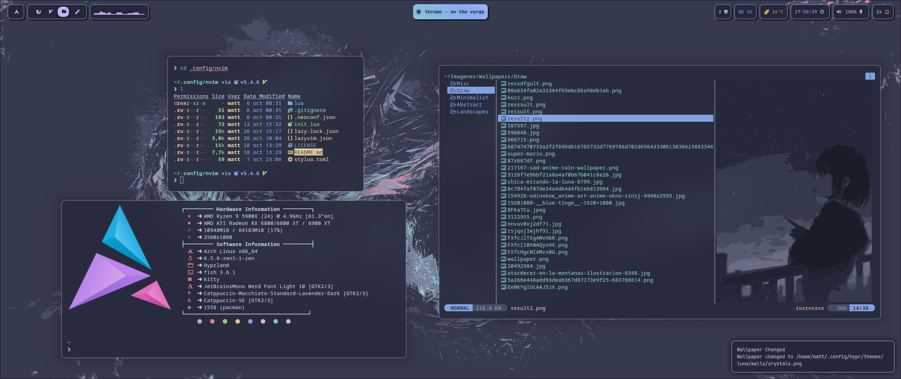 |

| **GUI Text Editor**                                    |
| ------------------------------------------------------ |
| 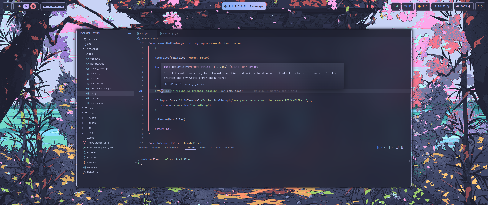 |

| **System Fetch, Matrix Script and Browser on [r/unixporn](https://www.reddit.com/r/unixporn/)** |
| ----------------------------------------------------------------------------------------------- |
| 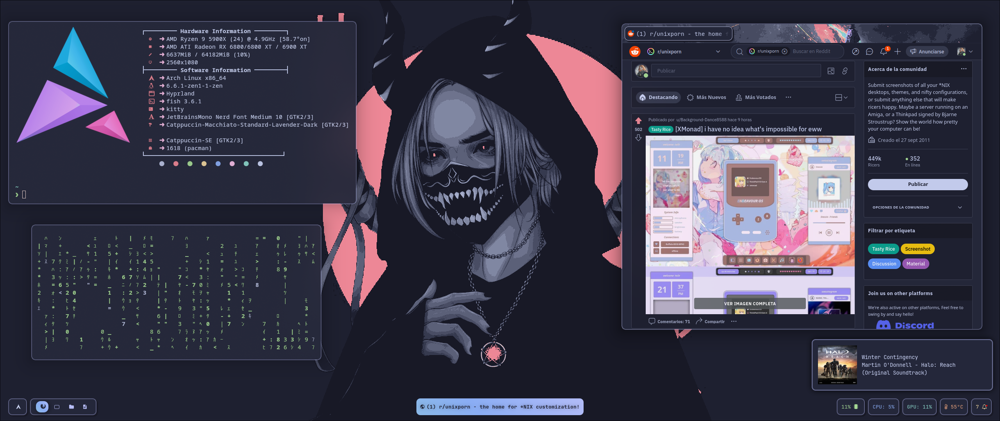                                          |

| **Browser with Main Page**                             |
| ------------------------------------------------------ |
| 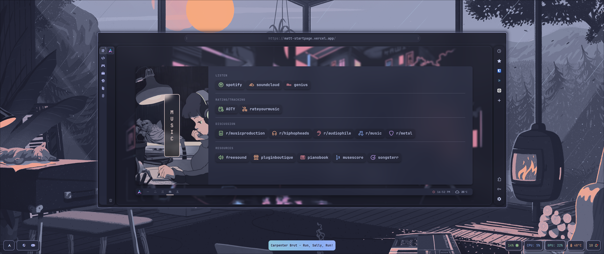 |

| **Lockscreen**                                         |
| ------------------------------------------------------ |
| 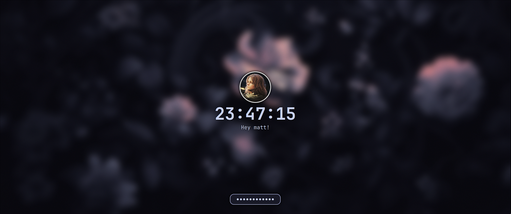 |

| **TUI System Monitor, Doom and Clock Script, ls replacement and Notif. Center** |
| ------------------------------------------------------------------------------- |
| 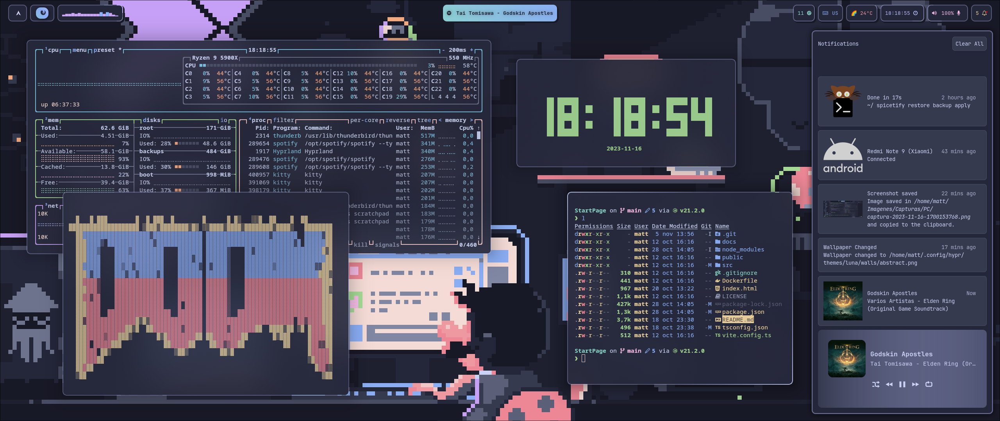                          |

| **Text Editor and Audio Visualizer**                   |
| ------------------------------------------------------ |
| 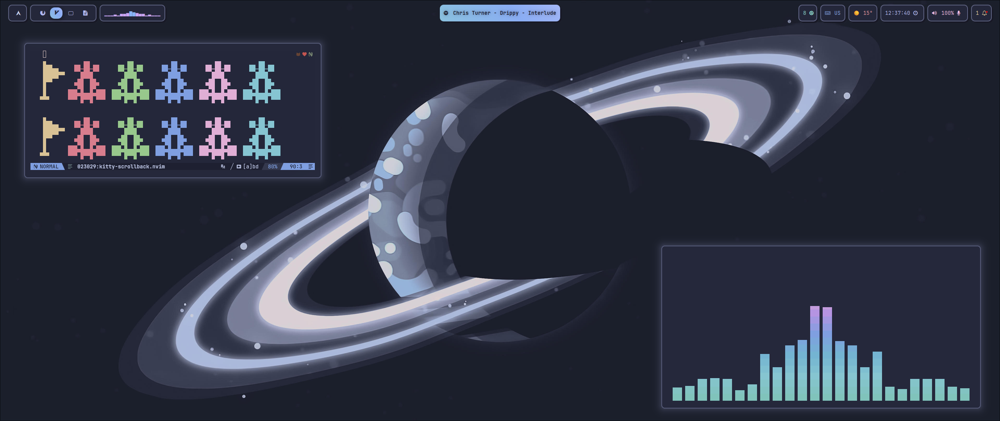 |

| **File Manager, pipes script and Note Taking App**       |
| -------------------------------------------------------- |
| 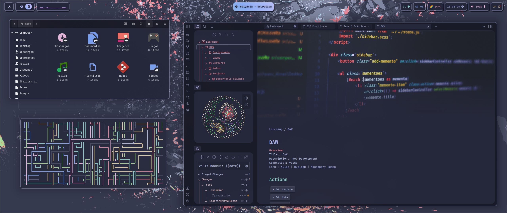 |

| **Text Editor and Git UI Manager**                       |
| -------------------------------------------------------- |
| 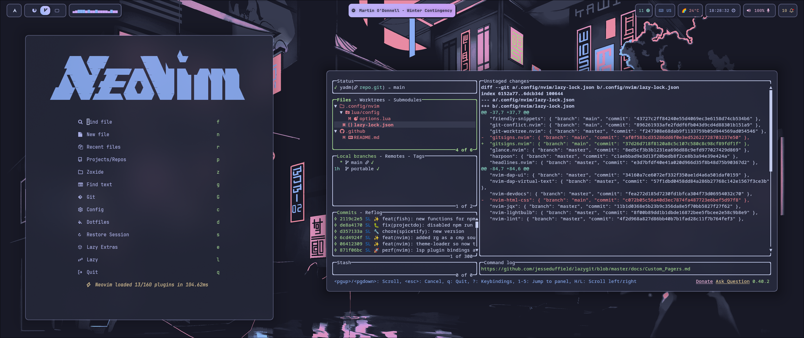 |

| **Audio Visualizer, Fuzzy Finder in a Git Directory and Image Viewer** |
| ---------------------------------------------------------------------- |
| 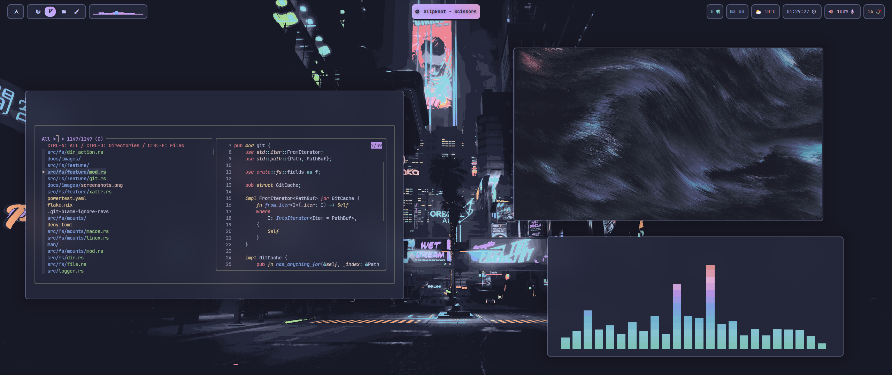               |

| **Text Editor**                                          |
| -------------------------------------------------------- |
| 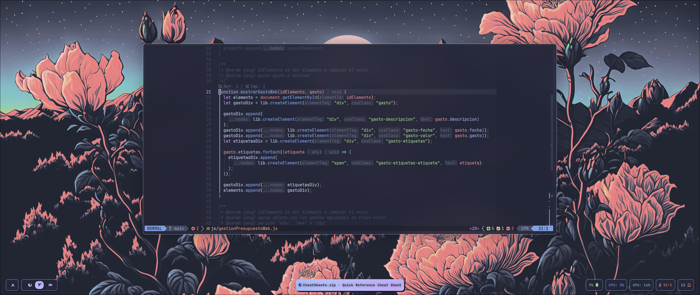 |

| **Game Platform and Music Player**                       |
| -------------------------------------------------------- |
| 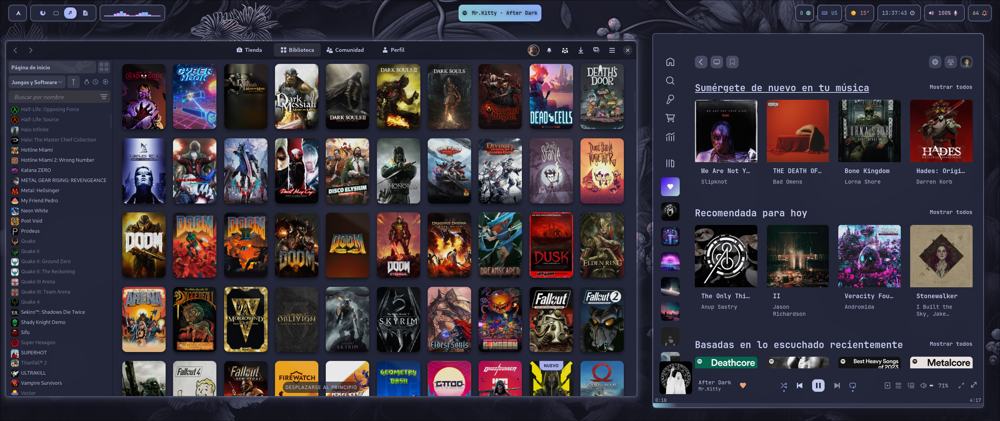 |

| **Text Editor**                                          |
| -------------------------------------------------------- |
|  |

| **Old Browser with Main Page**                           |
| -------------------------------------------------------- |
| 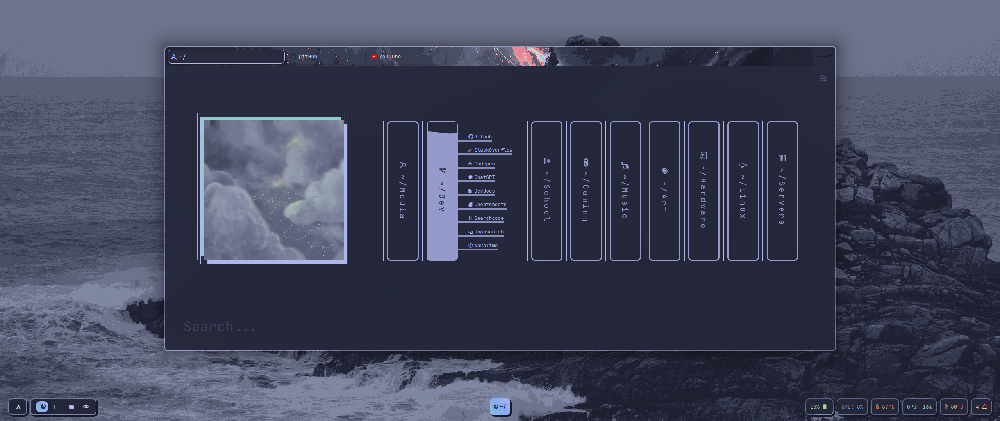 |
